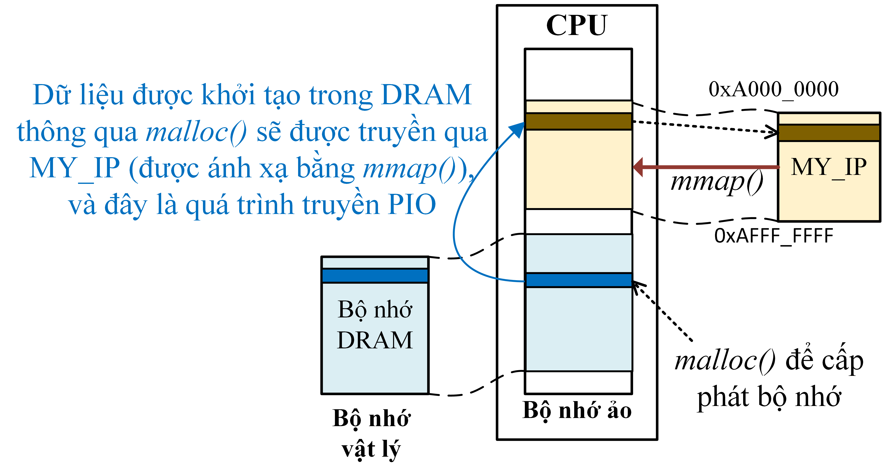
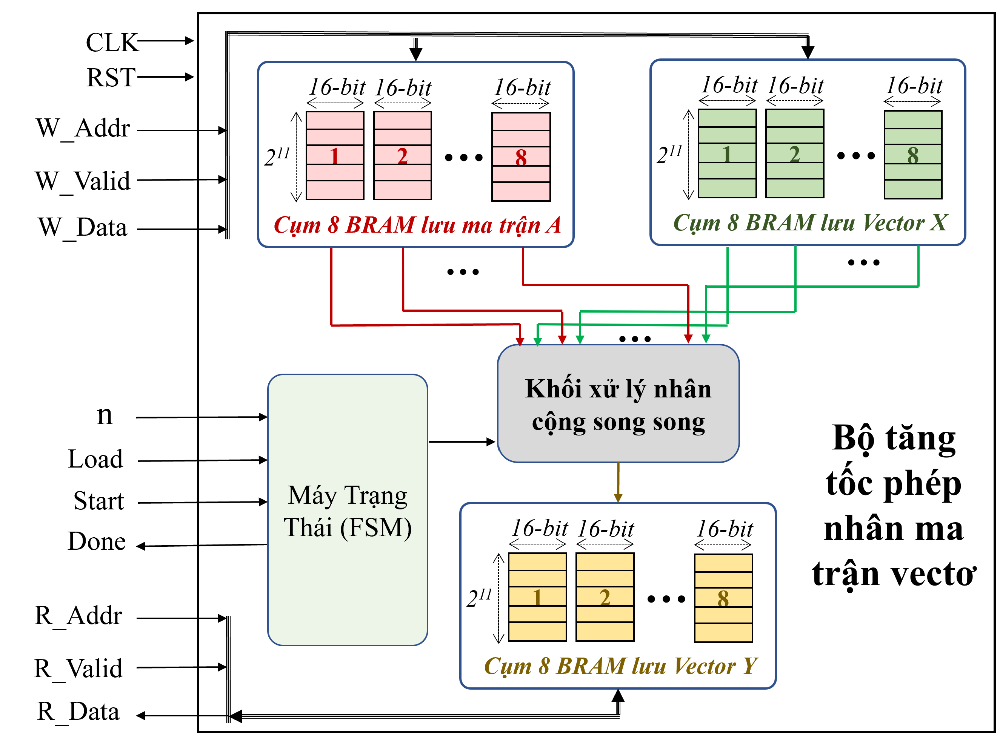
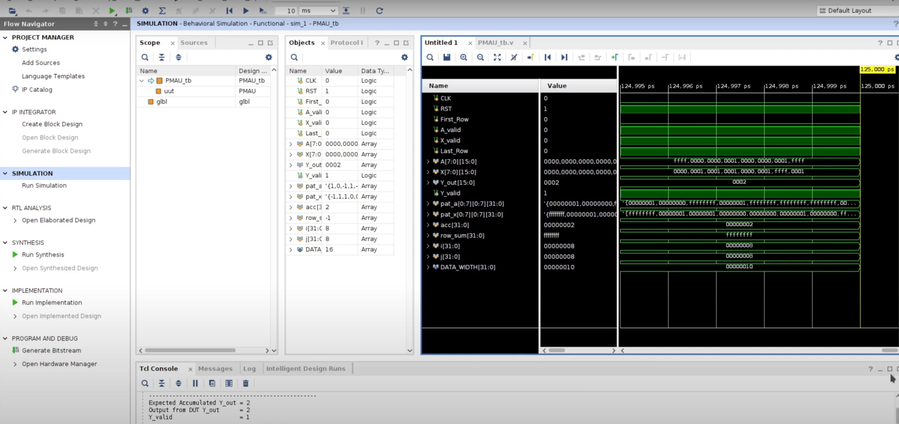

# 🎓 FPGA SoC Hardware and System Design – Level 1 (Kria KV260)

Welcome to **Level 1** in the **FPGA SoC Hardware and System Design** series.
This repository contains all the documentation, source code and tutorials related to implementing a simple hardware module and integrating it into a SoC system on the **Xilinx Kria KV260** board.

---
# Detailed video tutorial

The steps will be detailed in the corresponding video tutorial below, please click on the video below to see the details of each step 👇👇👇.

[](https://www.youtube.com/watch?v=iHpeTRM6k9U)

Or visit the link: https://youtu.be/iHpeTRM6k9U
---

## I. Algorithm requirements

This project implements a **hardware accelerator** to perform matrix A and vector X multiplication:

> **Y = A × X**

<p align="center">

</p>

where:
- `A` is a square matrix of size 2^n × 2^n (n ≤ 14),
- `X` is an input vector of length 2^n,
- `Y` is the result vector of length 2^n.

- The elements of matrix **A** and vector **X** only accept values ​​in the set {1, 0, -1}.

- All data A, X, Y are represented by signed 16-bit integers.

- The system supports dynamic size configuration through configuration registers.

- The accelerator includes:

- **FSM (Finite State Machine)** with 4 states: `IDLE`, `LOAD`, `EXECUTE`, `DONE`.

- **Internal BRAM** to store A, X, Y.

- Control interface uses **PIO (Programmed I/O)**.

- Data transmission uses **AXI-DMA**, bandwidth **128-bit per cycle**.

The lesson is designed for beginners with SoC system development on FPGA platform.

---

## II. Introduction and Requirements
### A. Introduction to PIO and DMA:

<p align="center">

</p>
In SoC FPGA systems, DRAM is often connected to user-designed IPs to provide high storage capacity, while supporting fast data retrieval for calculation or signal processing operations. DRAM stores temporary data for user-designed IPs. The way to use DRAM in SoC FPGA systems can be done through two main methods: PIO (Programmed I/O) and DMA (Direct Memory Access). In the PIO method, the CPU directly controls the data transfer between DRAM and IPs through I/O instructions, as shown in Figure (a) above. This method is easy to implement but can be very heavy on the CPU because the CPU has to handle all the data transfer operations. In contrast, DMA allows data transfer between DRAM and IPs without CPU intervention, reducing the CPU load and optimizing bandwidth, as shown in Figure (b) above.

<p align="center">

</p>
The figure above illustrates the difference between PIO and DMA transfer methods. In the PIO transfer method, as shown in Figure (a) above, a single transfer requires the CPU to control each data transfer between DRAM and MY_IP, with each data unit being processed separately. This method requires CPU intervention for each transfer operation, with the CPU having to send commands and process each data unit, which reduces performance and bandwidth efficiency because the CPU has to perform too many operations for each data unit. In contrast, in the DMA transfer method, as shown in Figure (b) above, data is transferred in the form of packets (burst transfers), allowing data to be transferred continuously from DRAM to MY_IP without CPU intervention. Data in DMA can be transferred continuously or spaced apart depending on the application requirements. Continuously transferring data in packets helps to maximize bandwidth utilization and minimize latency, because DMA is capable of transferring data from adjacent memory areas without interruption.

<p align="center">

</p>

The above figure illustrates the process of transferring data that is initialized in DRAM via malloc() and then transferred to MY_IP, where MY_IP is mapped into virtual memory via mmap(). This process shows the use of virtual memory to allocate memory, then transferring data from DRAM to MY_IP. This is an example of PIO (Programmed I/O) transfer, in which the CPU controls the transfer of data between DRAM and MY_IP via I/O instructions. In this process, MY_IP uses virtual memory that has been mapped from the physical memory area of ​​DRAM, allowing data to be accessed and transferred indirectly from DRAM to MY_IP.

<p align="center">

</p>

The above figure illustrates the data transfer from DRAM to the design IP via DMA transfer method. The data is stored in files on the SD card and then read into DRAM memory via standard access commands such as open("file"). Once the data is present in DRAM, the data transfer from DRAM to MY_IP is performed via DMA, which reduces the CPU load and optimizes bandwidth. This process does not require CPU intervention and ensures fast and efficient data transfer performance between memory and processing IPs.

### B. Introduction to BRAM:

Block RAM (BRAM) is an important component in FPGAs, providing the ability to store data directly on chip with low latency and high bandwidth. BRAM is larger in size than LUTRAM (RAM made up of LUTs), so it is often used to store larger blocks of data, supporting applications that require higher memory capacity. Structured as separate and independent memory blocks, BRAM allows for flexible design in data storage and retrieval, which is especially useful for high-speed applications such as digital signal processing, system control, and data processing in SoC systems. In IP designs, BRAM is often used as global memory to store large data that needs to be accessed by many different processing components, or as local memory to store temporary data and state in specific processing cores. This versatility makes BRAM a popular choice in complex FPGA designs.


<p align="center">

</p>

The figure above shows the interface of an 18 Kb BRAM block. BRAM memory supports a two-port interface (port A and port B), allowing independent reading and writing. Each port includes data input signals (DIA/DIB), address (ADDRA/ADDRB), clock (CLKA/CLKB), write control signal (WEA/WEB), and output control signal (DOA/DOB). Each port of BRAM, A and B, has its own signals for control and data transfer. The data input signal (DIA/B) and parity input signal (DIPA/B) provide data and check the integrity of data written to the memory. The address signal (ADDRA/B) determines the location of the data to be retrieved or written to. The WEA/B signal is the byte-width write enable signal, which determines whether data is written to memory. The ENA/B signal is the port enable signal; when inactive, no data is written to the BRAM and the output signal remains in its previous state. The RSTA/B signal is used to reset or synchronously reset the output registers when DO_REG = 1. The CLKA/B signal is the clock input signal for port A or B, which controls the speed at which the memory operates. The data output signal (DOA/B) and parity output signal (DOPA/B) provide data and parity information from the memory. Finally, the REGCEA/B signal is the output register clock enable signal, which controls the operation of these registers.

### C. List of equipment:
Below is a list of hardware equipment needed to practice Level 0 on the **Kria KV260 FPGA** board.


- **Kria KV260 FPGA**: Main board used to deploy SoC system and run embedded applications.

- **Network cable (LAN)**: Used to connect FPGA to the Internet via router/switch, support updating and debugging via SSH.

- **JTAG cable**: Connects from FPGA to PC Server to load bitstream, debug or act as UART cable to display Linux console on FPGA.

- **MicroSD card and card reader**: Used to create boot image (BOOT.BIN + Linux kernel + rootfs) and install operating system for FPGA.

- **Server PC (Linux)**: Install hardware design tools (Vivado), PetaLinux tools, and build the entire system.

- **Personal Laptop/PC (Windows or Linux)**: Used to connect SSH to the Server, or transfer files (WinSCP). If using Windows, you need to install **VMware** to run Linux.

⚠️ **Note:** You can replace **1 Server PC and 1 Laptop/PC** with **1 single Laptop/PC**, as long as the machine has Linux installed to install PetaLinux.

### D. Connecting the Devices

Before starting the hardware design process, it is necessary to connect and set up the following devices:

- **KV260 FPGA**: connect to the router via **network cable** to have internet, and connect to the Server PC via **JTAG cable** to load bitstream, debug.

- **Server PC**: used to install **Vivado** and **Petalinux**, connect to the network and memory card reader to prepare Linux for the FPGA.

- **Laptop**: used to control the Server PC and KV260 via **SSH connection** (via MobaXterm, VSCode, or Terminal).

⚠️ **Note**:
- The Server PC and Laptop need to be on the same internal network (LAN/WiFi).

- The microSD card will be used to load the Linux operating system into the FPGA.

<p align="center">

</p>

---

## III. Details of each step in the design process

<p align="center">

</p>

The SoC system design process on FPGA consists of 8 sequential steps, starting from defining requirements and describing hardware using Verilog, to IP packaging, system design on Vivado, setting up PetaLinux, and finally developing embedded software to control the designed hardware.

Next, I will present the above 8 steps in detail.

### A. Step 1: Determine system requirements and specifications (draw block diagram)

- Function to be implemented: **Y = A × X + B**, using the numerical standard **fixed point Q15.16** (1 bit sign, 15 bits integer, 16 bits decimal).

- Build a block diagram including multiplication, addition, register blocks and controlled by **FSM (Finite State Machine)**.

- FSM includes 3 states: `IDLE`, `EXECUTE`, `WAIT_DONE`, controlled through the signals `Start_in` and `Done_in`.

📌 Main signals:
`A_in`, `X_in`, `B_in` (input), `Y_out`, `Valid_out` (output), `Start_in`, `Done_in` (control)

<div style="text-align: center;">


</div>

### B. Step 2: Describe the hardware design and simulate the function

- Write **Verilog HDL** code to describe the digital circuit that performs the calculation **Y = A × X + B** with the **fixed-point standard Q15.16** for the operands.

- **RTL Verilog** source code is located in the directory:

- `RTL/MAC.v`

- Write **testbench** to simulate **10 test cases** with real values, check if the output `Y_out` matches the expected value. Run the simulation using **Vivado Simulator**, observe:

- Signal waveform on waveform

Calculation results printed to console window (PASS/FAIL each test case)

- **Testbench source code** is located in the folder:

- `TB/TB_MAC.v`

- **Project Vivado (2022.2)** pre-configured for simulation is located in the folder:

- `Simulation/`

<p align="center">

</p>

### C. Step 3: Package IP in Vivado

After describing the hardware using **Verilog HDL** and successfully simulating, we proceed to **package the design into an IP** so that it can be reused and integrated into the SoC system in the next steps.

The figure below illustrates how the **custom-designed IP (`MY_IP`)** is integrated into the SoC system and connected to the CPU via **AXI4 Bus**. The input/output signals of the circuit (`A_in`, `X_in`, `B_in`, `Start_in`, `Done_in`) are mapped via the AXI4-Full interface via the `AXI4 Mapping` class.

<p align="center">

</p>

- Refer to the content about **bus system including AXI4-Full** in the folder:

- `Tai_Lieu_Tham_Khao/Hieu Sy Bus.pdf`

Steps:

1. Open Vivado, select menu **Tools → Create and Package New IP**
2. Select IP type: from available RTL code (`Package your current project`)
3. Fill in the identification information for IP:
- IP name (`MY_IP`)
- Version (eg: `1.0`)
- Function description (Multiply-Accumulate core with FSM control)
4. Configure I/O signal ports and communication addresses:
- Mapping signals via standard **AXI4-Full** if using CPU communication
5. Check the entire configuration
6. Click **Package IP** to package and add this IP to Vivado IP Catalog

> This is a necessary step to be able to reuse IP in Block Designs.


### D. Step 4: Create Block Design for SoC system on Vivado

After successfully packaging IP, we proceed to create SoC system by using **Block Design** in Vivado.

Main components in Block Design diagram:

- **ZYNQ MPSoC**: main processor controls the system, configures pins and connects AXI.

- **Custom IP (MY_IP_v1_0)**: contains MAC function `Y = A * X + B`, connected via **AXI4-Full** standard.

- **AXI SmartConnect**: bridge between master/slave using AXI protocol.

- **Reset module**: synchronize reset signal between processing part and programming part.

#### Operations to perform in Vivado:

1. Create **New Block Design** from **IP Integrator** menu.

2. Add main components to the schematic (ZYNQ MPSoC, MY_IP_v1_0, AXI SmartConnect, Reset).

3. Use **Run Block Automation** to automatically configure ZYNQ.

4. Connect AXI and Reset ports properly.

<p align="center">

</p>

### E. Step 5: Synthesis, Place & Route, and Generate Bitstream File

After completing the connection diagram:

1. **Right-click on Block Design** → select **"Generate Output Products"**.

2. **Right-click again** → select **"Create HDL Wrapper"** to generate top-level code for the design.

3. Finally, click **"Generate Bitstream"** to run all the steps:

- Synthesis

- Implementation

- Bitstream Generation

> This is an important step to convert the design into a `.bit` configuration file that can be uploaded to the FPGA and a `.xsa` file to install Petalinux for the FPGA.

### F. Step 6: Set up PetaLinux environment and create drivers

After completing the hardware design and creating Block Design in Vivado, the next step is to **export the hardware file (`.xsa`)** for use in PetaLinux to create the appropriate operating system and drivers for the system.

#### 1. Export the hardware file (`.xsa`) from Vivado

- In Vivado, after **Generate Bitstream** is successful:

- Go to menu: **File → Export → Export Hardware**

- Select: Include bitstream

The `.xsa` file will be generated (e.g. `SoC_wrapper.xsa`)

#### 2. Install PetaLinux

- Download the **PetaLinux 2022.2** installer from the Xilinx official website:
🔗 https://www.xilinx.com/support/download/index.html/content/xilinx/en/downloadNav/embedded-design-tools/archive.html

##### Install dependencies (Ubuntu/Debian)

```bash
sudo apt-get install tofrodos gawk xvfb git libncurses5-dev tftpd zlib1g-dev zlib1g-dev:i386 \
libssl-dev flex bison chrpath socat autoconf libtool texinfo gcc-multilib\
libsdl1.2-dev libglib2.0-dev screen pax libtinfo5 xterm build-essential net-tools
```

##### Cấp quyền thực thi cho file `.run`

```bash
chmod +x petalinux-v2022.2-*.run
```

#####  Chạy trình cài đặt

```bash
./petalinux-v2022.2-*.run
```
- During the installation, the installer will display the license agreements:

- Use PgUp / PgDn to read

- Press q to exit the display

- Press y to agree and continue

#### 3. Build the hardware environment

##### Set up the Petalinux working environment

##### **Source** to the Petalinux installation directory to use the `petalinux-*` commands:
```bash
source <petalinux_install_path>/2022.2/settings.sh
```

##### Download the BSP installer for KV260 FPGA from the Xilinx official website:
🔗 https://www.xilinx.com/support/download/index.html/content/xilinx/en/downloadNav/embedded-design-tools/archive.html

##### Create PetaLinux project from BSP
```bash
petalinux-create -t ​​project -s <path_to_the_BSP_file>.bsp --name KV260_Linux
cd KV260_Linux
```

##### Importing hardware (.xsa) into the project After you export the .xsa file from Vivado (which contains the bitstream), use the following command to integrate the hardware into the project:
```bash
petalinux-config --get-hw-description=<path_to_the_hw_description_file>
```
##### Manually configure the kernel bootargs After running petalinux-config, the system will open the curses interface for you to configure further. Adjust the kernel bootargs configuration In the configuration window, perform the following steps:
 ```text
Subsystem AUTO Hardware Settings  --->
    DTG Settings  --->
        Kernel Bootargs  --->
            [ ] generate boot args automatically
            (user-defined) user set kernel bootargs
 ```

 Paste the following bootargs into the user set kernel bootargs section:
```bash
earlycon console=ttyPS1,115200 root=/dev/mmcblk1p2 rw rootwait cpuidle.off=1 uio_pdrv_genirq.of_id=generic-uio clk_ignore_unused init_fatal_sh=1 cma=256M

```
📌 This configuration helps boot the device correctly, enable the UIO driver, allocate CMA memory, and keep the clock for the custom IPs in the PL.

##### Edit the Device Tree (system-user.dtsi)

To enable the Linux operating system to use **custom IPs in the PL** via the `uio` driver, you need to edit the **Device Tree Overlay** file.

In the file at the path `KV260_Linux/project-spec/meta-user/recipes-bsp/device-tree/files/system-user.dtsi`, edit the file to:
```dts
/include/ "system-conf.dtsi"
/ {
    reserved-memory {
        #address-cells = <2>;
        #size-cells = <2>;
        ranges;
        reserved: buffer@0 {
                no-map;
                reg = <0x8 0x0 0x0 0x80000000>;
        };
    };

    amba: axi {
        /* GDMA */
        fpd_dma_chan1: dma-controller@fd500000 {
            compatible = "generic-uio";
        };

        fpd_dma_chan2: dma-controller@fd510000 {
            compatible = "generic-uio";
        };

        fpd_dma_chan3: dma-controller@fd520000 {
            compatible = "generic-uio";
        };

        fpd_dma_chan4: dma-controller@fd530000 {
            compatible = "generic-uio";
        };

        fpd_dma_chan5: dma-controller@fd540000 {
            compatible = "generic-uio";
        };

        fpd_dma_chan6: dma-controller@fd550000 {
            compatible = "generic-uio";
        };

        fpd_dma_chan7: dma-controller@fd560000 {
            compatible = "generic-uio";
        };

        fpd_dma_chan8: dma-controller@fd570000 {
            compatible = "generic-uio";
        };
    };

    amba_pl@0 {
        MY_IP@a0000000 {
                compatible = "generic-uio";
        };
    };

    ddr_high@000800000000 {
        compatible = "generic-uio";
        reg = <0x8 0x0 0x0 0x80000000>;
    };
};

```
The sample `system-user.dtsi` file is saved in the `KV260_Linux` folder on github.

##### Then build the project

```bash
petalinux-build
```

### G. Step 7: Create boot image and rootfs for Linux on SoC FPGA

After successfully building the project, type this command to package the BOOT.BIN boot file with the appropriate U-Boot for the system.

```bash
petalinux-package --boot --force --u-boot
```

Then plug the SD card into the PC, proceed to partition and format the SD card. **You can follow the detailed instructions in the Video tutorial above ** from minute **53:40 to 1:03:18** at the link below:

📥 [Download the Debian rootfs file here](https://drive.google.com/file/d/1ZcJYuVHpn8ER11nLCjwCUjfc5ykqP0tM/view?usp=sharing)

> This rootfs file contains a pre-configured Debian operating system for the ARM64 architecture, supports the XFCE interface and easily installs additional applications using `apt`.

### H. Step 8: Develop embedded software (Embedded C/ C++)

After fully preparing the Linux operating system on the FPGA, we proceed to run the self-designed IP control embedded program in the **C/C++** language.

#### Code directory
In this GitHub repo, the `Embedded_C_Code` directory contains the entire C source code that controls the IP MAC via PIO communication.

#### How to run

1. Open **WinSCP** software to connect from your personal computer to the **KV260 FPGA** board (via SSH).
2. **Copy the entire `Embedded_C_Code`** directory from this repo to the `/home/debian/` directory on the KV260.
3. On the terminal (or via MobaXterm), access the copied folder:
```bash
ssh debiang@<KV260 FPGA IP address> (Example 192.168.1.10)
cd Embedded_C_Code
sh run.sh
```
---

# 📬 For any suggestions or contact to solve errors when implementing this project, please contact:

- Facebook: [https://www.facebook.com/pham.luan.921/](https://www.facebook.com/pham.luan.921/)
- Email: [luanph@uit.edu.vn](mailto:luanph@uit.edu.vn)

Thank you very much for your companionship and support 🙏
**Wish you a happy and effective FPGA learning!**

If you find the content I share **useful, please practical and valuable for learning or research**, you can **support** me a little to motivate me to produce better quality sequels.

👉 **Note:** If you are a **student**, I **don't expect financial support** from you.

As long as you study well, understand the lesson and spread knowledge to those who need it, I'm very happy! 💙

---


